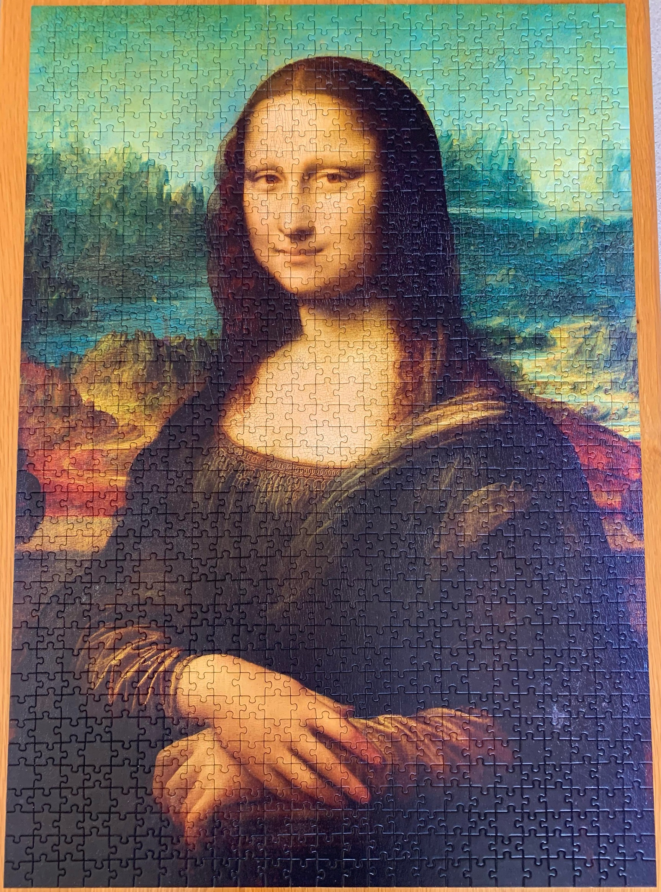
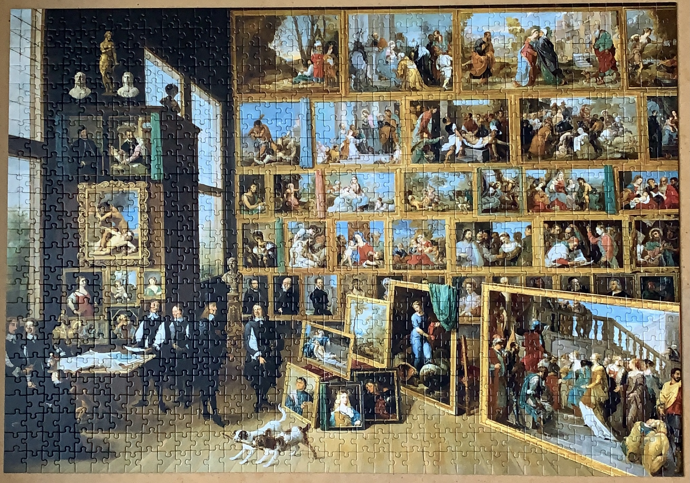
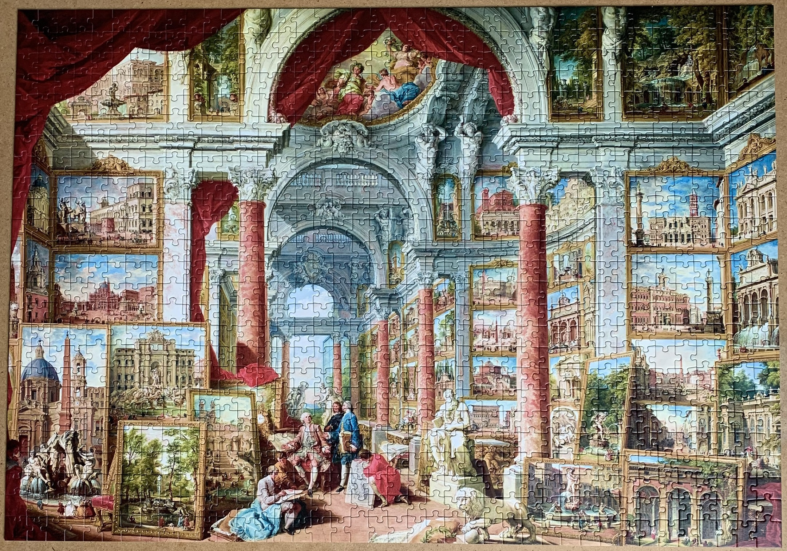

<a href="https://luffm.github.io/Jigsaw-Puzzles/">Jigsaw Puzzles</a>

## Mona Lisa (Leonardo Da Vinci)
2021-10-24 

 1000 pieces

## Archduke Leopold Wilheim in his Gallery in Brussels (David Teniers the Younger)
2021-07-07 

 1000 pieces

## Picture Gallery with Views of Modern Rome (Giovanni Paolo Panini)
2021-03-28 

 1000 pieces

<a href="https://luffm.github.io/Jigsaw-Puzzles/">Jigsaw Puzzles</a>

